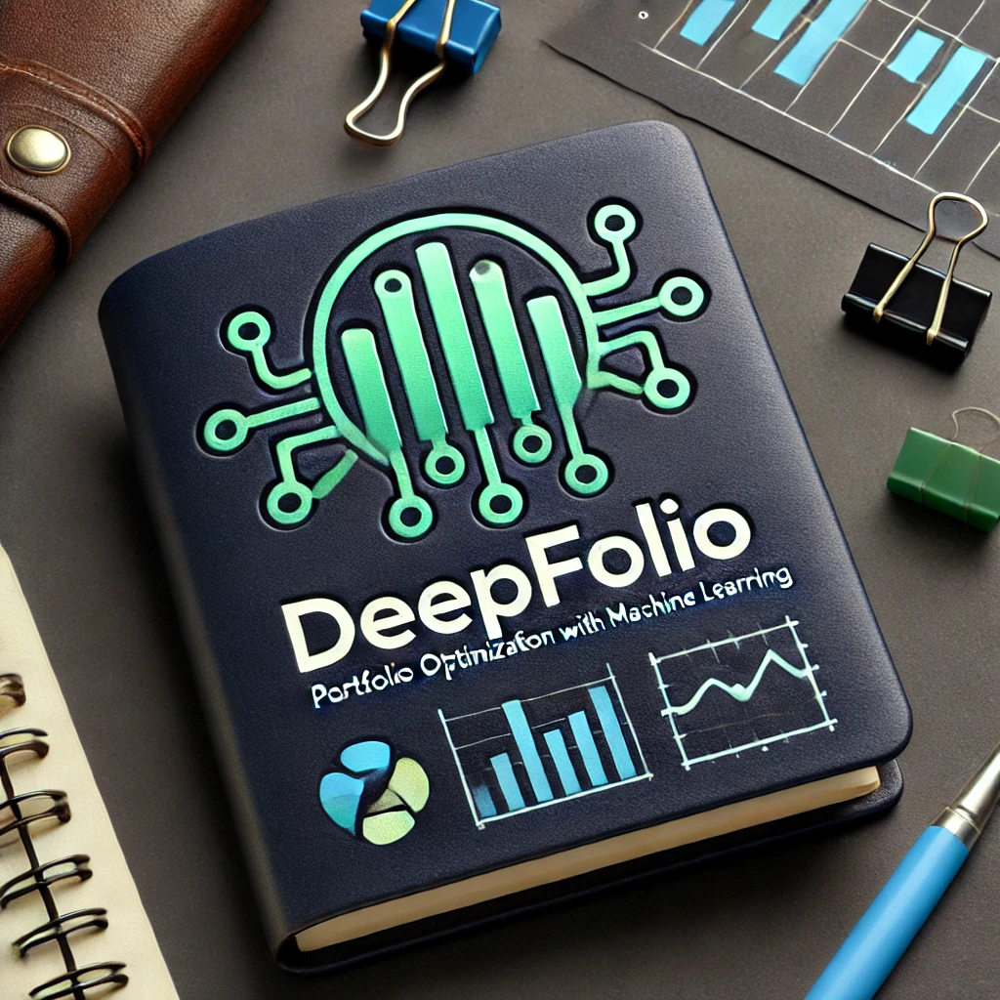

  

# **DeepFolio | Diffusion-Transformer (DiT) for Portfolio & Execution Optimization**  

DeepFolio is an **OpenAI Sora-inspired Diffusion-Transformer (DiT) framework** for **joint portfolio optimization and best execution**, designed to **maximize Sharpe ratio without explicit return forecasts**. It leverages:  
- **Transformer** to capture asset dependencies and encode market conditions.  
- **Diffusion Models** to filter market noise and generate both **robust allocation weights** and **optimized trading trajectories**.  
- **End-to-End Strategy Execution** to reduce information loss between **strategy design and execution implementation**, ensuring optimal real-world performance.  

---

## **🚀 Key Features**
✅ **Unified Portfolio & Execution Optimization** – Bridges the gap between portfolio construction and trade execution.  
✅ **Diffusion-Based Portfolio Generation** – Generates **adaptive, robust asset allocations** without relying on explicit return forecasts.  
✅ **Market-Aware Execution Path Modeling** – Uses **Diffusion Models** to optimize **execution trajectories**, reducing slippage and market impact.  
✅ **Scenario-Based Adaptation** – Dynamically adjusts strategies for **high/low volatility regimes, liquidity shifts, and market anomalies**.  
✅ **Transaction Cost-Aware Optimization** – Integrates **TCA (Transaction Cost Analysis)** into optimization, minimizing execution costs.  

---

## **📜 Architecture**
DeepFolio consists of **two core modules**:  

### **1️⃣ Portfolio Optimization** (Transformer + Diffusion)  
- **Transformer Encoder** extracts asset relationships, learning market structure.  
- **Diffusion Model** generates optimal portfolio weights, ensuring robustness under different conditions.  

### **2️⃣ Execution Optimization** (Trade Path Diffusion)  
- **Transformer encodes market microstructure (LOB, liquidity, volatility).**  
- **Diffusion Model optimizes execution paths** to minimize market impact and transaction costs.  

📌 **Pipeline Overview**:  

## Documentation

For detailed documentation, please visit our [documentation site](https://diffopt-portfolio.readthedocs.io).

## Contributing

We welcome contributions! Please see our [contributing guidelines](CONTRIBUTING.md) for more details.

## License

This project is licensed under the BSD-2-Clause License- see the [LICENSE](LICENSE) file for details.

## Reference
<a id="1">[1]</a> 
Damian Kisiel, Denise Gorse (2022). 
Portfolio Transformer for Attention-Based Asset Allocation
arXiv:2206.03246 [q-fin.PM]

## Acknowledgments

- This package leverages the power of TensorFlow for efficient portfolio optimization.
- Thanks to the financial machine learning community for inspiring many of the implemented methods.

